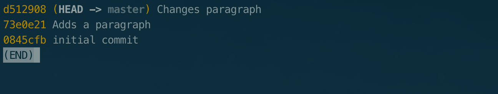
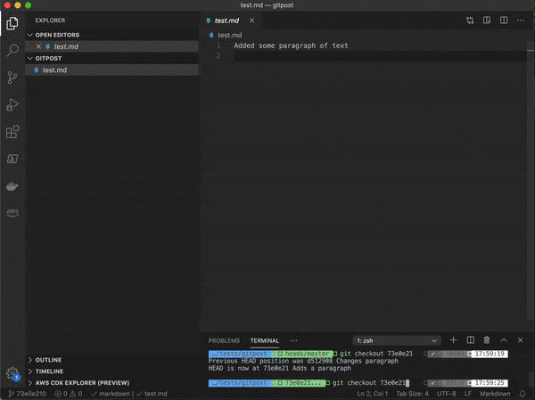
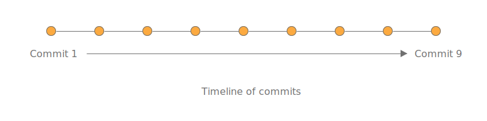
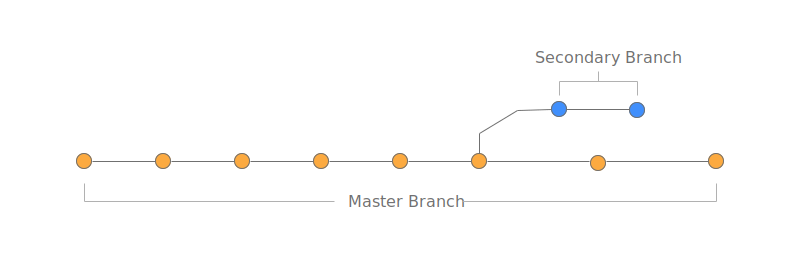
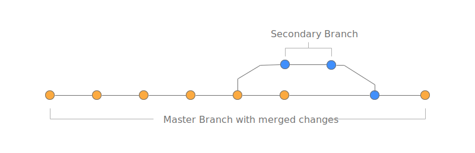

## What problem does git solve?

When you start a development project you create a folder to hold the files that
contain the code for your project, this folder can be organised by adding
sub-folders, this combination of folders and files containing code is known as a
codebase. You have a set of features that your software should accomplish and
you write the code to meet these requirements.

Once you’ve finished writing your code it is launched, for example, a website is
made public and people can visit the site. Over time the code that has been
written needs to change, it could need to change for any number of reasons, some
examples being:

- To fix a bug in the original code
- To add a new feature
- To remove a feature

Whenever code changes an element of risk is introduced. Here are some of the
risks and problems that can occur:

- Changes can introduce new bugs
- Stakeholders can decide they prefer the old version meaning the code needs to
  be changed back
- Other developers working on the codebase may not know about changes made and
  how they affect any subsequent changes that need to be made

## How does git solve the problem?

Git is a version-control system and was built to tackle these problems by
tracking changes made to a codebase. Git works by taking a snapshot of the
codebase at a given point in time, this point in time is decided by the
developer making changes to the code. When we add git to our codebase our
codebase is known as a git **repository** or repo for short.

## Snapshots of a codebase

When a developer changes the code, git is aware of the changes that have been
made by comparing what has been written to the previous snapshot. When a
developer is happy with the code that has been written the developer **commits**
the code and a new snapshot is created.

When code is committed the snapshot created is called a **commit**, a commit
contains the codebase at the time of the commit, the unique id of the commit and
a message written by the developer about what has changed and **why**.

As you can see in the image above each commit has an id and a message associated
with the commit. Should a developer need to revert the codebase back to a
previous commit they can. This is done by **checking out** a specific commit,
when a commit is checked out the codebase will update to match the snapshot
captured at the time of the commit being checked out.

Here’s a gif showing how checking out different commits affects a particular
file:

In the gif above I’ve used the commit id to checkout different commits, as you
can see the file updates as the commit is checked out.

Using the commit id to checkout code is suitable for looking at a very specific
commit. However, developers will commit code many times throughout the
development process in the same way that people save a word doc regularly to
avoid losing their work.

How do we specify important commits, such as the final commit in a series of
commits that completes a feature? To do this, git allows us to **tag** the
codebase at a specific point in time. A tag works in the same way as a commit
with the exception that it can be referred to by the tag id specified by the
developer.

## Branches

So far throughout this article we’ve discussed git in the sense of a single
timeline of commits. A change is made, the change is committed and a new
snapshot of the code is created. We make another change and another commit is
created and the cycle repeats.

The ability to store our code at a point in time offers a lot of benefits but it
is not the end of the story. Let say we have a feature that we want to implement
in our codebase and whilst working on that change another, more important change
is requested. At this point with our current mental model of git we are left
with a couple of options:

- Abandon the changes made so far and revert to a previous commit so the new
  feature can be worked on
- Finish the current feature before implementing the latest requested feature

Both of these options are not ideal, thankfully git provides two mechanisms that
allow us to keep our current change and work on the new feature without losing
any work. The first feature that we will discuss is branching, the second
stashing. With git we can create a **branch** which allows us to add one or more
additional timelines to our codebase.

Having a separate branch allows us to create a separate stream of commits that
are independent of other branches. What’s more, git allows us to switch between
these branches easily. When we are finished working on a feature and we want to
combine a branch with another we simply **merge** the two together.

## Stashing

Stashing is the second concept that allows us to ‘jump’ back to a previous
commit whilst storing our current uncommitted changes. When we tell git to stash
our changes we are asking git to take any code that isn’t committed, save it and
revert to the last commit. We are then free to continue coding and we can
reapply our stashed code later. In most cases when you want to apply your
stashed code you will need to create a separate branch to avoid conflicts but we
will discuss this in more detail in a later post.

## Summary

Throughout this post we have discussed the use of git, the problems git aims to
address and the core concepts of git. In the next article I will bring the
topics discussed to life with examples, showing you how to set up git and how
these examples work in the real world.
