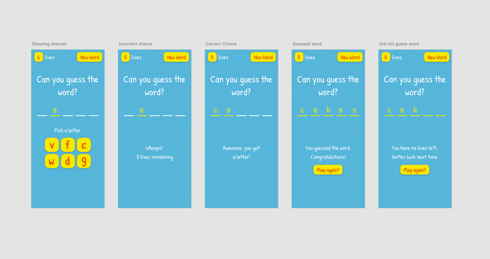

## Process overview

The process I follow includes many of the standard pillars of software
development and can be seen in both waterfall and agile methodologies. The basic
outline of the process I follow is:

1. Plan
2. Reduce scope
3. Design
4. Build
5. Launch
6. Review

I’m going to take you through this process step-by-step using my latest project,
[multiplayer hangman](https://hangman.mrmadhat.com) as an example.

## Planning

### Idea

The idea for my latest project came after playing _Cards Against Humanity_ with
my family through a site called [allbad.cards](https://allbad.cards/). The site
allows multiple people on different devices to play the popular game together
from any location. I was interested in learning about how real-time
communication works in web apps and wanted to build something that would help me
learn. I decided to recreate the classic game of hangman but a multiplayer
version that allows people to play together.

### Basic Requirements

Once I had the basic idea I then spent some time planning out how I wanted the
game to work by writing a list of steps involved during a typical session:

- **Host creates a game session**
  - Host provides username to be used during the session
  - A unique link is generated for the session that can be shared with other
    players
  - Players join using the link: Username required to join
  - Host starts game once all players have entered
  - player order is decided here and doesn't change throughout the session
- **Game**
  - setup
    - Word to guess is chosen at random
    - The group of players (team) is assigned a number of lives
    - The player to go first is randomly chosen
    - Each player is shown n blank spaces representing the letters of the word
  - Turn
    - Player whose turn it is is shown a collection of letters to choose from
      - 1 letter of the collection is in the word and the rest are not
    - Player chooses a letter
      - If correct the letter is revealed
      - If not a life is deducted from the game
    - Player attempts to guess the word
      - If correct game ends and a new game starts
      - If not two lives are deducted

I also drew some sketches to further clarify my thoughts about how I wanted the
game to work.

## Reduce scope

Reducing the scope of work required is the most important part of my development
process. It's at this point I ask myself “What can be removed that means I can
launch by the end of the day?” this question is critical because it allows me to
focus on the most important features whilst postponing the less critical.

> **“What can I removed that means I can launch by the end of the day?”**

I like to use a day as a timescale because it means that the risk of failure is
reduced. As long as I've been realistic with what I think I can accomplish I
should be able to build it in a day. Even when I've underestimated the work
required the project generally overruns by days rather than months. The shorter
development cycle also means I can get the product in front of users quicker and
gain valuable feedback which can then direct further development.

### What I removed

In the case of the hangman project I removed the majority of the features and
decided my first iteration would focus purely on the core game without
multiplayer functionality. Yes, the purpose of creating the game is to explore
real-time communication but that can only happen once there is a game that can
be played.

Plus, don't forget that we're talking in terms of days not months. Tomorrow I
can work on adding multiplayer functionality if I want to and I can do so
knowing that the core functionality of the game is taken care of and I don't
need to worry about it.

I took my sketches and narrowed them down to just one main sketch with slight
variations for user notification, such as when the user guesses wrong. I also
rewrote my functionality tasks to narrow down the steps needed.

## Design

In previous side-projects I would skip the design initially and end up paying
for it later. Completing the design first not only saves time but also removes
headaches because design and development decisions aren't mixed. The less
context switching the better.

I created a main design housing the major components then made some additional
copies that included other essential features. Here’s the designs:

## Build

With the bulk of the thought process completed for the game and the design in
hand the build is really straight forward. I took my reduced "steps of the game"
that I wrote when I reduced the scope and began thinking about each item in more
detail:

- Game
  - Setup
    - Word to guess chosen at random
    - Initial number of lives given
    - Player shown n blank spaces representing the letters of the word
  - Turn
    - If player has lives remaining
      - Generate and display letters to choose from
      - Player makes letter choice
        - Correct: the letter is revealed
        - Incorrect: a life is taken
    - If player doesn't have lives remaining
      - Show "Better luck next time" message and restart game button
    - If all letters are known
      - Show "Congratulations!" message and restart game button

I also sourced a list of
[common english words](https://github.com/first20hours/google-10000-english) for
use within the app and setup my project to use
[husky](https://github.com/typicode/husky) to run tests and lint my code before
being committed. Lastly, I built out the game in React using `create react app`,
view the source [here](https://github.com/mrmadhat/hangman-game).

## Launch

In practically no time the game was ready to be deployed. I want the process of
deployment to be automatic and I want to spend the least amount of time thinking
about it as possible.

For this project I chose github pages for the deployment, whenever I want to
deploy I just type `npm run deploy` and latest changes will automatically be
published. One change I would like to make to this workflow is to setup a github
action that will automatically deploy whenever there is a commit on the master
branch. Another, arguably simpler option would be to move the hosting to netlify
where deploys would automatically happen on push to the master branch.

## Review and feedback

Overall I’m happy with how the first iteration of the game turned out. I shared
it with my friends and family to get some initial feedback, they said that the
game is quite difficult and would be better if it was easier. Another piece of
feedback I received was that the game should show the word when the player runs
out of lives.

This feedback is invaluable, if I was building the game as something to generate
profit then this initial feedback would allow me to quickly add improvements to
the game that users actually want. This all comes back to the speed of delivery,
you should constantly strive to strip anything that’s unnecessary and build the
most important thing first then iterate quickly based on real-world feedback.

## Summary

Hopefully this article has been helpful, if it has and you'd like to hear read
more stories from me please consider subscribing to my mailing list.
