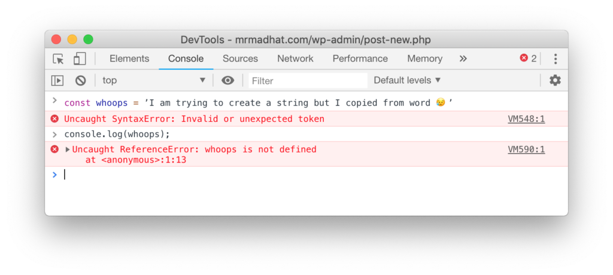

I recently attended a meetup where quite a lot of people where new to web
development and where interested in pursuing it as a career. Throughout the
course of the event I realised that a lot of these people where causing
themselves a lot of headaches and as anyone who's been through the process of
learning web development will know, the last thing you want to do is be giving
yourself more obstacles and headaches than what's necessary.

Throughout this article I'm going to outline some of the things that I wish
someone would have told me early on and should hopefully help people new to web
development get off to a good start.

## Starting your journey: Becoming a web developer

Before we jump into the nitty gritty there are two things I would like to point
out:

### 1\. You need to become a life learner

You will soon find that website development is a very fast paced industry which
is constantly changing, this can be both exciting and daunting at the same time.
There will be times that you will get frustrated and there will be times when
you feel overwhelmed by the seemingly never ending "mountain" to climb. You need
to know upfront that this continuous learning is part of the job and isn't going
to change. But being aware of this will at least prepare you for what is about
to come "Fore warned is fore armed".

### 2\. It's about building a strong foundation

When it comes to web development (and most other things) there is no shortcut to
success, the foundations you lay at the beginning of your journey will serve you
well into your career. When you learn, learn slowly with concentration and fully
commit yourself to the process. The worst thing you can do is skim over what you
are learning in haste to "get it done" and later find that your haste is your
downfall and back to the drawing board you go to start the learning process
again properly.

## Learning: The technologies of the web

The web is made up of three key technologies, HTML, CSS and Javascript. When you
visit a website in your browser at least one of these languages will be used,
and for a great majority of the time all three will be used.

### HTML (Hyper Text Markup Language)

HTML provides the structure of a webpage, it's how you say "I would like a
heading here and a paragraph and image there".

### CSS (Cascading Style Sheets)

CSS is applied to your HTML to change it's appearance for example, you can take
your heading and tell the browser that the text found in the heading should be
blue, red, pink or any other colour you would like.

### Javascript

Javascript handles the behaviour of a web page by manipulating your HTML and
CSS. This change could be as a result of user interaction (such as a mouse
click) or a timed event (every 5 seconds swap the image).

## Approach to learning HTML, CSS and Javascript

You should learn HTML first as CSS and Javascript are useless without it\* e.g
you can't use CSS to change the appearance of an element (such as a heading)
that doesn't exist. Once you've got a handle on HTML I would learn CSS, with
HTML and CSS you have the tools to create websites that have content and look
great. Finally (at least for now), learn javascript so that you can add
functionality and interact with your users. At the end of this article I've
added some resources to get you started.

\*Useless in this context. Javascript could be used in other scenarios without
the immediate need of HTML.

### Focus on true comprehension

As mentioned previously, a strong foundation is key to success. When learning
you should be relentless in un-complicating the complicated. When you read,
watch or hear something for the first time and you become confused do your best
to keep working through whatever it is that is confusing you, keep digging until
the new concept is no longer confusing.

Once you understand the subject be sure to revisit the topic again after a few
days to check your understanding. Another tip (not my own) is to find someone to
explain the concept to (or explain it out loud on your own) being able to
explain something and have the listener understand is a good sign that you have
a good grasp on the subject.

## Practice, practice, practice

There's only so much you can gain from learning theory you need to get your
hands dirty to truly understand and build muscle memory in your brain (if there
is such a thing). A typical approach for me goes as follows:

1. Research the topic I want to learn
2. Attempt to build something, applying what I've learnt
3. Get confused/get stuck
4. Attempt to understand where I've gone wrong
5. Rest
6. Research the topic more, possibly re-reading documentation/tutorials
7. Repeat the above steps until I feel I have truly mastered the topic

This approach has worked for me in the past and I hope it proves useful for you
too.

## Adopting the problem solver mindset

You need to learn these languages to be able to build websites but these
languages are merely tools. Your job will be to use these tools to solve
problems. The problems you have to solve can vary widely, it's one of the things
that makes web development and programming in general fun! The problems you face
will usually be associated with one or more people/actors:

### The customers' problems

Customers are the people that will either be the owner of the website you are
creating (clients) or the people who actually use the websites you create (end
users). You will have one or both of these types of customer, even if you are
your own client 🙃

#### Client problems

Clients have very high level problems such as "I want to make more money" and
they generally have a very high level solution "I want to make more money so I
need a website" (sometimes they will say this as though there is a pot of gold
at the end of any web development project).

#### End user problems

End users, the people who will use the websites you build will often have more
direct problems, such as "The website is slow", "I'm struggling to complete x
action" and so on.

### Web developer problems

Your problems are the results of breaking down these high level problems. Here
is where you will face many sub-problems that are like puzzles for you to solve,
like I said, fun! An example, the client wants the menu to "zoom" onto the
screen, how do we accomplish this?

### The point

The point of mentioning these different types of problems, is to highlight the
importance of learning to become a good problem solver, you will often feel like
you are as much a detective as you are a developer.

## Choosing an editor

To start writing code you need a place where you can write. As a programmer you
need some form of text editor that is built for writing code (talking bare
minimum, you could just use notepad but this post is about making life easy)
there are many options to choose from with varying levels of features and price
points. I currently use [VS code](https://code.visualstudio.com/) which is a
free and open-source editor  that is available for windows, linux and mac.

### A note on Microsoft Word

Repeat after me "Microsoft word is NOT for web development". I was horrified
when someone said to me "I'm struggling with x here's my code" and the person
showed me code in Word.

Even if you are just copying from one place to paste in another (for example
copying some custom javascript from Stackoverflow to your WordPress theme's
custom javascript field) and using word as a place to store your code for later,
this is still a terrible idea.

Take the previous example where word is taking the role of middle man, when you
paste your code into word any quotation marks or apostrophes will be stylised,
when you paste that code elsewhere to use it it will not work because the
javascript compiler doesn't understand these "smart" quotation marks. This is
just scratching the surface we've not even talked about how you would save your
code out, I'm not going to go into this further just trust me it's not a good
idea.

## A note on Tools

We've talked about the main technologies of the web but before bringing this
article to a close I wanted to talk a little more about tools. You will quickly
find that there is a sea of tools available to you as a web developer, this is a
great thing in the respect that there are lots of tools built by some very smart
people to help you do your job better and make your life easier. The downside is
that the shear amount of tools available and the constant emergence of new tools
can be overwhelming and lead to feeling like you are always playing catch up,
don't worry you are not alone. I don't want to overwhelm you by mention tons of
tools but I will mention two that you are likely to come across very quickly.

### Package managers

A package is collection of code that has been written by someone to perform a
particular task and a package manager is an online 'library' for storing
packages. [NPM (Node Package Manager)](https://www.npmjs.com/) is an extremely
popular package manager for javascript.

### Version control

Version control tools allow you to save and retrieve your code at a particular
point. This is useful because you may want to 'roll' your application back or
you may want to work on a new feature without loosing the current working
version of your website. [GIT](https://git-scm.com/) is a popular choice for
version control. Similarly to NPM, Github is a popular website for storing your
git projects.
[See this article for a better explanation of git and Github](https://www.howtogeek.com/180167/htg-explains-what-is-github-and-what-do-geeks-use-it-for/).

### Frameworks and libraries

A library is a codebase that gives you a set of functions you can call to
achieve a task (libraries can be stored as packages on NPM) for example you can
use the [add](https://lodash.com/docs/4.17.11#add) function of the
[lodash](https://www.npmjs.com/package/lodash) library to add some numbers
together. A framework is similar in that it provides code that you can use but
specifies a way to complete a task, you take it as a whole rather than cherry
picking what you want as with libraries.

## Going further: Server side programming and databases

Note: If you find yourself getting confused in this section, don't worry, it's
something that you can come back to later after conquering the basics. Remember,
it's important to go slow and steady the information below is just provided as
an overview.

After a you've been developing for a while you may start wondering if there's a
way to stop repeating yourself over and over again each time. This is where
server side programming languages and databases come into play. A server-side
programming language runs on a server (a computer that completes a specific
task, it serves) and will connect to a database to retrieve the data which it
stores.

When navigating to a static (HTML, CSS and JS) website a typical request to a
website will look like this:

1. User types a domain e.g www.example.com into a browser (makes a request)
2. The web address is converted to an IP address using a Domain Name Server
   (DNS)
3. The request travels across the network until it reaches the server with the
   IP address that it is looking for.
4. The server accepts the request and will return the requested file (in this
   case a HTML file)
5. The browser receives the HTML file and loads it, if it finds a link to an
   image, CSS or Javascript file it will make additional requests to get these
   'assets'
6. Once this process is complete you will see the fully loaded web page

When using a server-side programming language things change, when a request is
made the server will run some code to perform certain actions before returning
the html to the user. These actions could be checking that a user is logged in
before sending back the information contained in the page, it could be to
connect to a database and return the requested data that is held in the database
(for example a blog post). The process explained above is typical of a
monolithic web application and differs when it comes to a service based
architecture, but this is going way out of scope for this article. For more
information on
[different types of web architectures see this article](https://medium.com/koderlabs/introduction-to-monolithic-architecture-and-microservices-architecture-b211a5955c63).

## Conclusion

We've covered an awful lot of ground in this article, we've talked about getting
set up with an editor, talked about the technologies of the web, discussed a
process for learning these technologies and the mindset you need to adopt
throughout your journey. We also briefly touched on server-side programming and
databases. If you are feeling a little overwhelmed right now, try to focus on
taking your journey to learning web development
[one step at a time](/achieving-clarity-of-thought/). If you're hoping to start
a career in web development trust me when I say, if you're committed you will
get there!

## Resources

[An introduction to web development by Mozilla the company behind Firefox](https://developer.mozilla.org/en-US/docs/Learn)

[Moving on from that introduction more from W3C](https://www.w3.org/wiki/The_web_standards_model_-_HTML_CSS_and_JavaScript)

[Googles web fundamentals](https://developers.google.com/web/fundamentals/)

[Javascript 30 - Build 30 things in 30 days with Vanilla Javascript by Wes Bos](https://javascript30.com/)
