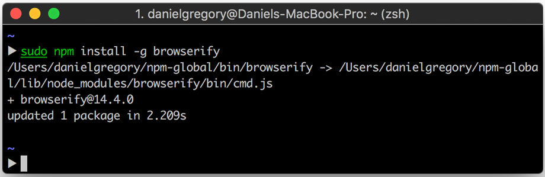
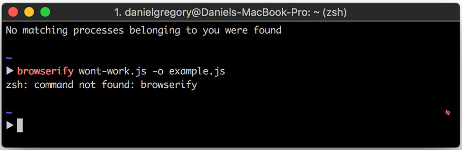
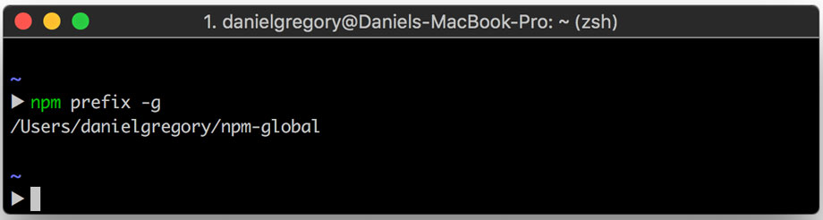
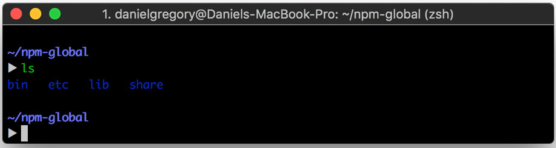
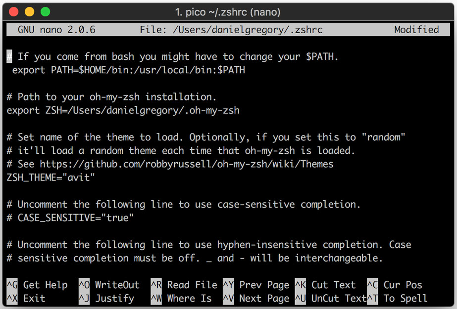
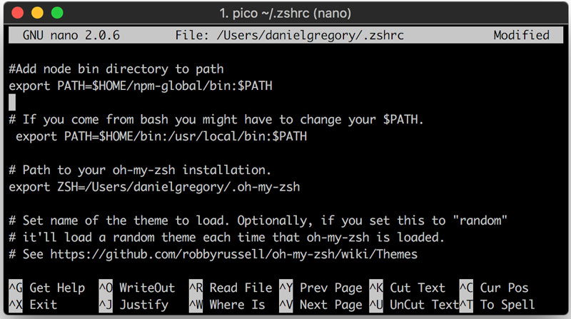
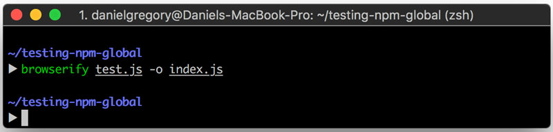

If you've recently switched to [zsh](http://ohmyz.sh/) and found that you can no
longer use globally installed [npm](https://www.npmjs.com/) packages here's the
fix.

**tl;dr**

You need to update your `$PATH` variable to include the npm bin directory

## The problem

You've switched to zsh and everything's going well. You want to install a new
package globally for example browserify so you can use it:

```bash
npm install -g browserify
```



So far so good but now you try to use the package

```bash
browserify wont-work.js -o example.js
```



What's going on? Why is it not working? The answer is that zsh doesn't know
where to find the recently installed package (or any other globally installed
package for that matter). First, let's find out what the current npm prefix is.

```bash
npm prefix -g
```

This will tell you the current prefix for npm



Let have a look at the contents of the directory

```bash
cd ~/npm-global
ls
```



Here you can see the bin directory. This is what needs to be in your `$PATH`. If
you want you can cd into that directory to take a look (it will list any global
packages you have installed) but for the sake of not repeating myself, I won't
list that step here.

You can check what is currently in your `$PATH` variable by using the following
command in terminal

```bash
echo $PATH
```

## Adding the bin directory to our path

So now we know what we need in our `$PATH` but how do we add it? First we need
to open up our zsh config file.

```bash
pico ~/.zshrc
```



From here we can add the bin directory to our path add the following to the top
(, middle or bottom if you prefer) of the file.

```bash
#Add node bin directory to path

export PATH=$HOME/npm-global/lib/node_modules:$PATH
```



The first line is just a comment to remind you why the line is in there if you
come back to this file in the future. The second is what actually adds the file
to your path. The `$HOME` variable is the location of my home directory and at
the end I've added everything that's currently in the `$PATH` variable
seperating it via colon.

now exit pico using CMD+X and saving your changes.

Once again echo `$PATH` to check the bin directory has been added. You should
see the path to your node bin directory at the beginning. Only one more thing to
do restart your terminal and you should be good to go.



Success!
